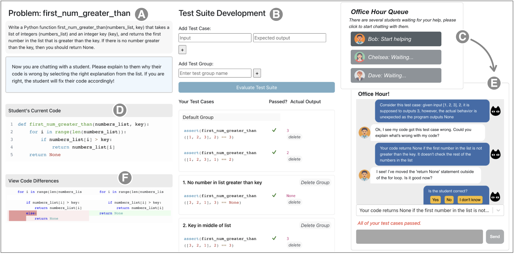

# How to Teach Programming in the AI Era? Using LLMs as a Teachable Agent for Debugging [(Paper)](https://arxiv.org/abs/2310.05292)

**🏆 Best Paper** @ [AIED 2024](https://link.springer.com/chapter/10.1007/978-3-031-64302-6_19)



In HypoCompass, given a programming problem description (A), a student user (in the role of a Teaching Assistant) needs to compile a test suite (B) and assist multiple LLM-simulated agents (e.g., Bob, Chelsea, Dave) in an Office Hour Queue (C) through a chat interface (E). Each LLM-agent acts as a novice seeking help with a buggy solution (D) and provides feedback to the user (F).


**Content Directory**
```
├── README.md
├── study_material
│   ├── supplements.pdf
│   ├── llm_generate_materials.ipynb
│   └── ...
└── system
    ├── README.md
    ├── backend/
    │   ├── problems/
    │   └── ...
    ├── frontend/
    └── ...
```

## study_material: 
`supplements.pdf` ([link](http://tinyurl.com/hypocompass-sup)): The tables of all 6 problems used in the LLM experiment, success criteria for all generated materials, and full prompts used in all types of generations.

`llm_generate_materials.ipynb`: The script used to create all materials for the LLM experiment, including test case category hints, test case hints, buggy programs (and their corresponding distractors), explanations of bugs, and programs with bugs fixed. The directory also include the 3 problems that are not included in `system/backend/problems/`.


## system:
`README.md`: instructions for setting up the system locally. 

`backend/problems/`: 3 problems used in the user study, including: 
* problem description (`description.txt`), 
* input test cases (`inputs.txt`), 
* reference solution (`refsol.py`), and 
* LLM generated materials including 
  - test case hints (`tests_hint.json`), 
  - explanation and fix instructions (`codes_data.json`), and 
  - code files (correct and buggy).


Video Demo for the training system: https://youtu.be/K0CkQjxbBSQ 

You can also check out an interactive demo of HypoCompass hosted [here](http://141.148.1.3:8080/).